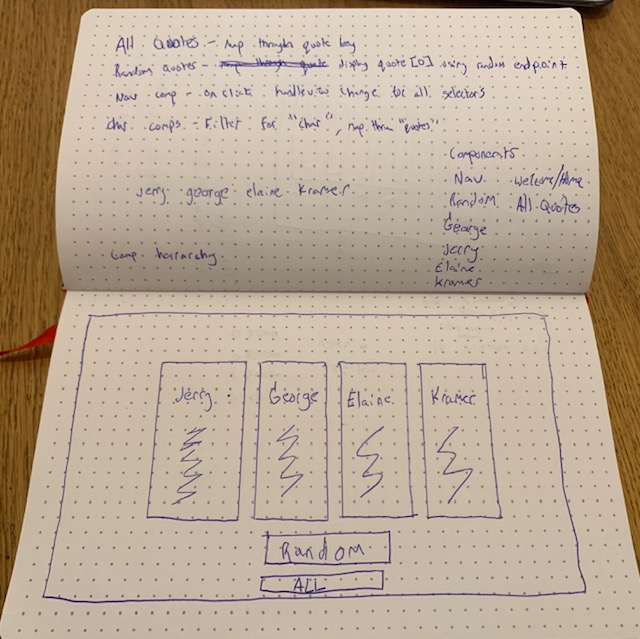

# Project Overview

## Project Description

Seinfeld Quotes

## MVP

Being able to access All Quotes and filter for Quotes from each of the main characters

## POST MVP

Use the quotes to create a trivia game (Guess who said the quote)

## Wireframes

Include images of your wireframes.

## Game Components
-All Quotes
-Nav (component that handles the switch view cases)
-Jerry, George, Elaine, Kramer Components
-Trivia Component
-Main page component

### Landing Page
The welcome(main) Page, they will be able to access all views(components) from this view

## Ideas I'm kicking around/trying to implement
A graph that counts how many quotes each character has an represents the data in a chart
Getting Season and Episode data into the individual character pulls
Rewrite code using Hooks

## Additional Libraries
API Host
 https://seinfeld-quotes.herokuapp.com/quotes

## Code Snippet  

## Javscript Discoveries

## Issues and Resolutions

## Deployment Link
Deployed Project
http://coordinated-crayon.surge.sh/

Youtube Presentation
https://www.youtube.com/watch?v=T7pxnFzVVA8&feature=youtu.be
